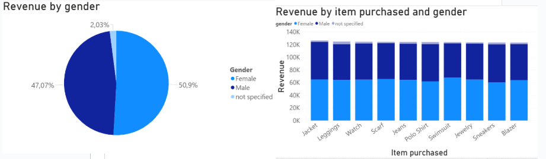
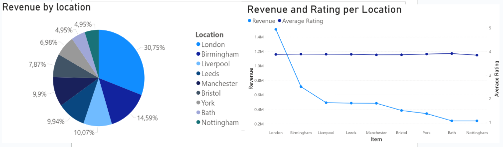

## 1. Background and Overview

### Business Context

This project analyzes a **synthetic e-commerce dataset** created for educational and portfolio purposes, representing a UK-based online retailer specializing in **clothing and jewelry**. The company is entirely fictional, and the dataset does not aim to perfectly replicate real-world market conditions.

While the data was generated to resemble common e-commerce structures (transactions, customers, products, time-based variables), certain distributions and patterns may appear simplified or idealized. This is intentional: the primary focus of the project is not realism at the market level, but rather the **end-to-end analytics process**, including data cleaning, querying, and insight generation.

Over the course of **one year**, the dataset contains approximately **50,000 transactions**, generating **£4.89 million in total revenue**. These figures provide sufficient scale and complexity to simulate a **mid-sized e-commerce scenario** for analytical practice.

The dataset enables structured exploration of how products, customers, and time-based factors can be analyzed to extract business insights within an e-commerce context.

---

### Objectives

From a **data analytics perspective**, the primary objective of this project is to support **data-driven decision-making** by identifying actionable patterns that can improve business performance. Specifically, the analysis aims to:

* Identify **high-value products** based on sales volume, revenue contribution, and customer ratings.
* Understand **customer behavior patterns**, including purchasing frequency and value generation.
* Detect **temporal trends** (day, hour, seasonality) that concentrate sales and revenue.
* Provide insights to **optimize product offering, operations, and customer experience**.

These insights are framed to reflect the type of questions a real e-commerce business would ask to improve profitability and efficiency.

---

### Technical Approach

For readers interested in the technical implementation, the project follows a structured analytics workflow:

* **Data Cleaning & Exploration**: Performed using Python to inspect data quality, handle inconsistencies, and prepare the dataset for analysis.

  * Python script available here → 

* **Business Question Analysis**: Core business questions are addressed using SQL, focusing on aggregations, segmentation, and trend analysis.

  * SQL queries available here →

## 2. Structure & Initial Data

### Dataset Overview

The dataset contains **50,000 rows** and **14 columns**, representing transactional-level data over a one-year period.

Each row corresponds to a single purchase event and includes customer attributes, transaction details, product information, and contextual variables (time and seasonality).

---

### Column Structure & Data Types

| Column Name        | Data Type | Description                                             |
| ------------------ | --------- | ------------------------------------------------------- |
| customer_id        | int       | Unique identifier for each customer                     |
| age                | int       | Customer age                                            |
| gender             | string    | Customer gender                                         |
| item_purchased     | string    | Product purchased                                       |
| value_in_pounds    | float     | Transaction monetary value (£)                          |
| time               | time      | Time of purchase                                        |
| day_of_week        | string    | Day when the purchase occurred                          |
| location           | string    | Customer geographic location (UK-based)                 |
| season             | string    | Season during which the purchase occurred               |
| review_rating      | float     | Customer rating associated with the purchase            |
| subscription       | string    | Indicates whether the customer has a subscription       |
| shipping_type      | string    | Type of shipping selected                               |
| previous_purchases | int       | Number of purchases made before the current transaction |
| payment_method     | string    | Payment method used                                     |

---

### Logical Data Model (Entity Grouping)

Although the dataset is stored as a single flat table, it can be logically structured into relational entities for analytical clarity.

#### 1️⃣ Customer Entity

| Columns      |
| ------------ |
| customer_id  |
| age          |
| gender       |
| location     |
| subscription |

Represents static or semi-static customer attributes.

---

#### 2️⃣ Transaction Entity

| Columns            |
| ------------------ |
| customer_id        |
| value_in_pounds    |
| time               |
| day_of_week        |
| season             |
| previous_purchases |
| payment_method     |
| shipping_type      |

Represents purchase-level operational and behavioral information.

---

#### 3️⃣ Product & Experience Entity

| Columns        |
| -------------- |
| item_purchased |
| review_rating  |

Captures product identity and post-purchase evaluation metrics.

---

### Initial Data Checks

Before analysis, the following validation steps were performed:

* Verification of data types and schema consistency
* Inspection for null or missing values
* Detection of duplicate records
* Basic distribution checks (age, revenue, ratings)
* Correction of inconsistent text value

These initial checks ensured that the dataset was analytically consistent before proceeding to SQL-based business exploration and visualization.

## 3. Executive Summary

The business has achieved a robust **£4.89M in total revenue** across **50,000 transactions**, maintaining a healthy **3.9 / 5 average customer satisfaction rating**.

Operationally, the commercial engine is stable and capable of generating consistent revenue. However, the analysis reveals a clear **"Value Gap" within the subscription model**, representing the most significant immediate growth opportunity.

While the company is well-established, it currently operates primarily on a **transactional revenue logic**. To scale effectively, the strategy must shift from *volume-chasing* to *value-deepening* — specifically by targeting and monetizing the underperforming subscriber segment.

In short:

* The revenue base is strong and diversified.
* Customer satisfaction is solid but not exceptional.
* Subscriber monetization does not yet reflect its strategic potential.
* The next growth phase depends on increasing Customer Lifetime Value rather than simply increasing transaction count.

---

### Key Business Indicators

  

### Strategic Insights

#### 1️⃣ Subscription Value Gap

Both **subscribers and non-subscribers spend approximately £98 per capita**, despite subscribers representing only **20% of the customer base** and theoretically belonging to a premium segment.

This indicates that the subscription model is currently **under-optimized and under-monetized**.

  

---

#### 2️⃣ Balanced Customer Base & Gender Preferences

Revenue distribution is nearly balanced across gender segments, suggesting that the brand appeal is broad and not overly dependent on a single demographic group.

However, product-level analysis reveals preference patterns:

* **Swimsuits** show stronger performance among female customers.
* **Sneakers** show stronger performance among male customers.

  

---

#### 3️⃣ Geographic Performance & Expansion Opportunity

Sales performance scales naturally with city size, yet **average customer ratings remain consistent across all locations**, indicating stable product and service quality.

This operational consistency represents a competitive advantage.

  

### 4. Deep Insights

We have identified four critical points to work on that will bring the most out of this analysis.

#### The Underutilized Subscription Tool
Despite a 20% subscriber base, the loyalty program is currently failing to drive incremental spend per transaction. The Average Order Value (AOV) for subscribers is £98.15 compared to £97.87 for non-subscribers. This implies that the current subscription model functions primarily as a retention tool rather than a monetization one. The gap is virtually zero, meaning loyal customers are not being incentivized to increase their basket size.

  

  

#### The Star Products Metric
We measured a balanced rating performance across all products, with a global average rating of 3.9/5. Nevertheless, some low-rated and some high-rated products show growth potential, and their promotion should be increased. **Star products** — products with both high revenue and high rating — are the safest drivers of ROI and should be prioritized in marketing and assortment strategies.

  

#### Operational Seasonality Performance
Autumn is the peak revenue season (£1.24M), and transaction volume spikes significantly on weekends. This means staffing must match demand both seasonally and on peak days; otherwise, delivery delays could lead to significant customer dissatisfaction.

This presents an opportunity to enhance star products so they can perform well in other seasons besides autumn (for example, swimsuits in summer), thereby increasing overall revenue.

  

#### Demographic Balance
The female segment contributes £2.49M vs. the male segment's £2.30M, indicating a nearly even split in revenue. Growth based on demographics does not require pivoting to a niche market. Instead, it requires category-specific personalization: strengthen products for each segment based on the analysis (for example, targeting swimsuits to women and sneakers to men) to improve conversion rates within the existing base.

  

### 5. Recommendations

To shift from chasing volume to deepening value, we recommend the following actions based on the data findings:

#### Short-Term
- Increase subscribers' AOV by 10–15% through exclusive product bundles and subscriber-only offers.  
- Match staffing to demand on weekends and during autumn to ensure delivery times and maintain service quality.

#### Mid-Term
- Investigate the supply chain for high-volume products with ratings below 3.5. Improving the quality of these items will reduce churn and returns. Start tracking returns KPIs (returns rate %, average return value, and reason codes) if not already monitored.  
- Leverage the brand's stable reputation to expand into high-growth mid-sized cities where competition is lower, using current logistics hub data as a baseline for expansion.

#### Long-Term
- Integrate profitability metrics by shifting analytics focus from gross revenue to net margin. By integrating Cost of Goods Sold (COGS) data, the business can identify which products actually drive bottom-line profit, not just top-line sales.

